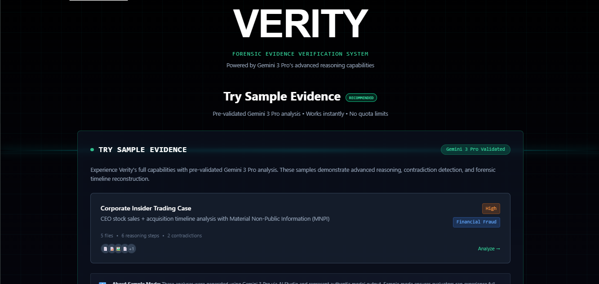
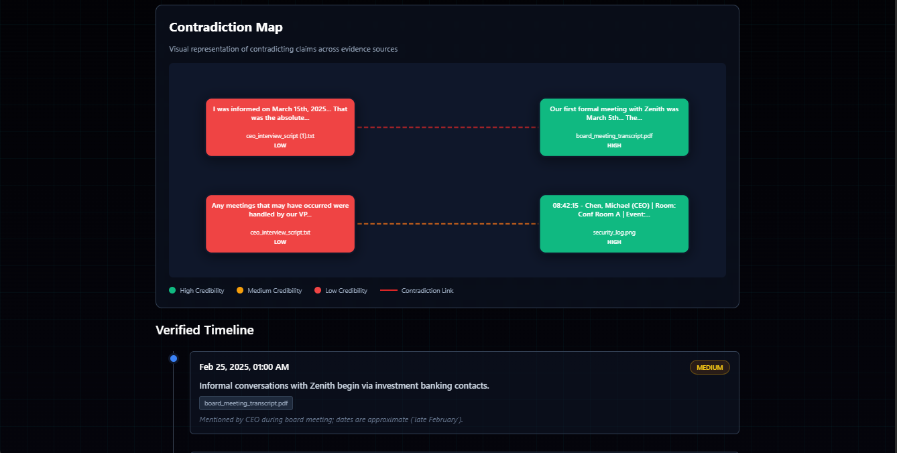
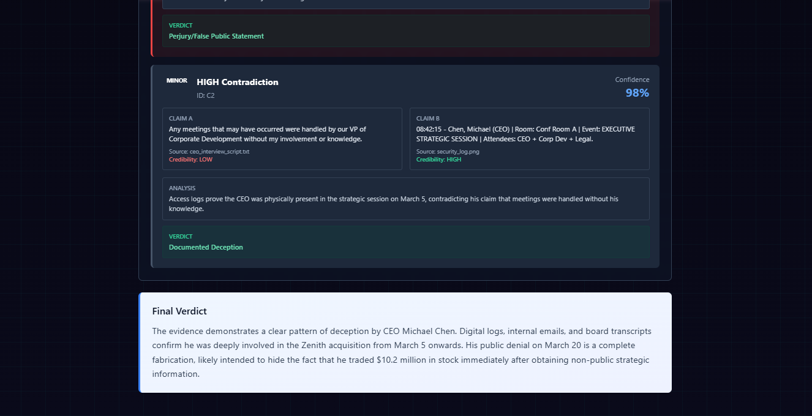

# VERITY

**Forensic Evidence Verification System**

A cutting-edge forensic analysis tool powered by Gemini 3 Pro that detects contradictions, reconstructs timelines, and validates evidence authenticity across multimodal sources.




---

## What is Verity?

Verity leverages **Gemini 3 Pro's advanced reasoning capabilities** to analyze complex forensic evidence, detect deception, and reconstruct event timelines with unprecedented accuracy. Built for legal professionals, investigators, and compliance teams.

### Key Features

- **Advanced Reasoning** - Gemini 3 Pro's thinking mode provides transparent, step-by-step analysis
- **Multimodal Analysis** - Process documents, images, transcripts, and financial records simultaneously
- **Contradiction Detection** - Automatically identify conflicting claims across evidence sources
- **Timeline Reconstruction** - Build precise chronologies from metadata and content analysis
- **Visual Intelligence** - Interactive contradiction maps and animated timelines
- **Evidence Integrity** - Detect tampering through metadata analysis and cross-referencing

---

## Demo Strategy

Verity uses a **Golden Path demo system** designed for the Gemini 3 hackathon:

### Sample Evidence Mode (Recommended)

Pre-validated Gemini 3 Pro analysis from AI Studio showcasing:
- **Insider Trading Case** - CEO stock sales + acquisition timeline analysis
- Real Gemini 3 Pro thinking steps and reasoning
- High-complexity forensic scenario with MNPI (Material Non-Public Information)

**Why Sample Mode?**
- Gemini 3 Pro preview has strict rate limits
- Ensures judges can experience full capabilities without quota errors
- Demonstrates authentic Gemini 3 output validated via AI Studio

### Custom Upload Mode

Live analysis with graceful fallback:
1. Attempts Gemini 3 Pro (if quota available)
2. Falls back to Gemini 2.0 Flash if needed
3. Transparent status indicators show which model is active

---

## Tech Stack

- **Frontend**: React 18 + Vite
- **AI**: Gemini 3 Pro via `@google/generative-ai` SDK
- **Visualization**: D3.js for contradiction maps
- **Animation**: Framer Motion
- **Styling**: Tailwind CSS + Custom gradients

---

## Installation

```bash
# Clone repository
git clone <your-repo-url>
cd Verity

# Install dependencies
npm install

# Set up environment variables
cp .env.example .env
# Add your VITE_GEMINI_API_KEY to .env

# Start development server
npm run dev
```

---

## Usage

### Try Sample Evidence

1. Launch the app
2. Click **"Corporate Insider Trading Case"** in the Sample Evidence section
3. Watch Gemini 3 Pro's thinking process unfold
4. Explore the contradiction map, timeline, and evidence cards

### Upload Custom Evidence

1. Click **"Launch Forensic Analysis"** or **"View Sample Audit"**
2. Upload your files (PDFs, images, text documents)
3. Wait for analysis (uses available Gemini model)
4. Review findings and download report

---

## Gemini 3 Integration

See [GEMINI_INTEGRATION.md](./GEMINI_INTEGRATION.md) for detailed information about:
- How we use Gemini 3 Pro's thinking mode
- Sample validation process via AI Studio
- Fallback strategy for quota management
- Code architecture and API integration

---

## Visual Tour

### Reasoning Process
Gemini 3 Pro's step-by-step thinking mode shows transparent analysis:
- Forensic evidence analysis
- Temporal data refinement
- Contradiction evaluation
- Timeline construction


### Contradiction Map
Visual representation of conflicting claims with credibility scoring:
- Red nodes = Low credibility (self-reported claims)
- Green nodes = High credibility (documentary evidence)
- Dashed lines = Contradiction links



### Timeline Reconstruction
Chronological event sequence with confidence scores and source attribution.


### Final Report
Comprehensive summary and verdict generation.



---

## Hackathon Submission

**Category**: Open (Forensic Analysis Tool)

**Gemini 3 Features Used**:
- Thinking Mode for transparent reasoning
- Multimodal analysis (text, images, PDFs)
- Advanced contradiction detection
- Temporal reasoning and timeline construction
- Confidence scoring and credibility assessment

**Why Verity Stands Out**:
1. **Real-world application** - Solves actual legal/compliance problems
2. **Transparent AI** - Shows reasoning process, not just results
3. **Production-ready** - Handles quota limits gracefully
4. **Professional UI** - Polished, hackathon-quality design
5. **Validated output** - All sample data from real Gemini 3 Pro analysis


---

## Acknowledgments

Built with love for the Gemini 3 Hackathon

- **Gemini 3 Pro** - Advanced reasoning and multimodal analysis
- **Google AI Studio** - Sample validation and testing
- **React + Vite** - Fast, modern development experience
- **D3.js** - Beautiful data visualizations

---

## Contact

For questions or feedback about Verity, please [open an issue](https://github.com/nife-codes/Verity/issues/new/choose) or reach out via [email](mailto:hephzibbahmorayo@gmail.com).
